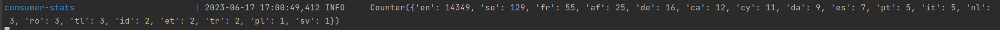
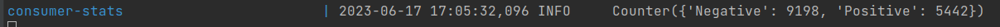
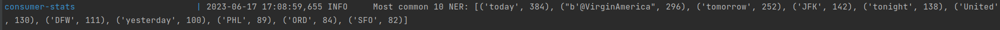

# Capstone project (Project B. E2E data processing pipeline - processing social media data (twitter))

Collaborators:
 - Vadym Popyk
 - Oleksii Zarembovskyi
 - Daria But

1. We have chosen the Twitter dataset from [Kaggle](https://www.kaggle.com/datasets/crowdflower/twitter-airline-sentiment).
2. Here is our kafka environment with 3 brokers - [docker-compose.yml](https://github.com/ctrldash/capstone-twitter-project/blob/c6e74a4b0cc11b4771116fd5c3b5d06b1b9b5f64/docker-compose.yml).
3. Implemented message [generator microservice](https://github.com/ctrldash/capstone-twitter-project/blob/c6e74a4b0cc11b4771116fd5c3b5d06b1b9b5f64/message_generator).
4. Implemented the [microservice](https://github.com/ctrldash/capstone-twitter-project/blob/c6e74a4b0cc11b4771116fd5c3b5d06b1b9b5f64/consumer_language) 
that detects a language of a tweet.
5. Implemented the [microservice](https://github.com/ctrldash/capstone-twitter-project/blob/c6e74a4b0cc11b4771116fd5c3b5d06b1b9b5f64/consumer_sentiment) 
that recognizes sentiment class of a tweet.
6. Implemented the [microservice](https://github.com/ctrldash/capstone-twitter-project/blob/c6e74a4b0cc11b4771116fd5c3b5d06b1b9b5f64/consumer_ner)
that recognizes Named Entities (persons) a tweet.
7. Implemented the [microservice](https://github.com/ctrldash/capstone-twitter-project/blob/c6e74a4b0cc11b4771116fd5c3b5d06b1b9b5f64/consumer_stats)
that generates and displays statistics :
   - list of languages with numbers of messages
    
    

    - number of messages among sentiment classes
    
    

   - top 10 Named Entities
    
    

To reproduce our results - clone the repository and run:

``
docker compose up
``